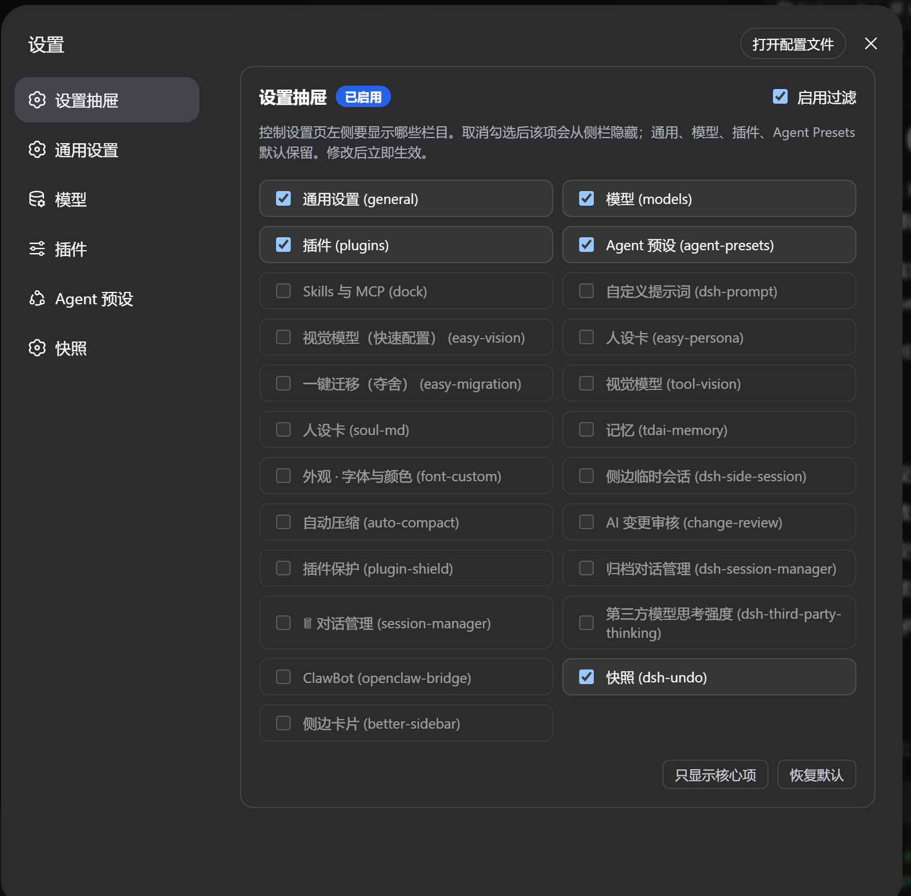

# Settings Drawer (`dsh-settings-drawer`)

A DeepSeek Harness web UI plugin that lets you choose which items appear in the settings left nav.

Unchecking an item hides it from the sidebar immediately. Core pages (General, Models, Plugins, Agent Presets) stay visible by default.

[中文说明](README.zh.md)

## Preview



## Features

- Hide or show any settings section from the left navigation.
- Changes apply immediately and persist in your browser.
- Automatically discovers newly installed plugins that register a settings section.
- Core settings pages stay protected by default.
- Pure client-side UI plugin — no extra services, no network calls.

## Install

From GitHub:

```sh
dsh plugin --profile web add github:zizhongfeiyang/dsh-settings-drawer
```

Desktop / EAC users typically use the `web-desktop` profile:

```sh
dsh plugin --profile web-desktop add github:zizhongfeiyang/dsh-settings-drawer
```

From the packed tarball (attached to each [release](https://github.com/zizhongfeiyang/dsh-settings-drawer/releases)):

```sh
dsh plugin --profile web add ./dsh-settings-drawer-1.1.1.tgz
```

After installing, restart the web service or refresh the page.

## Usage

1. Open **Settings**.
2. Open **设置抽屉** (Settings Drawer) at the top of the left nav.
3. Uncheck items you do not want to see. They disappear from the sidebar immediately.

## Configuration

| Item | Value |
| --- | --- |
| npm package name | `dsh-settings-drawer` |
| UI display name | 设置抽屉 / Settings Drawer |
| localStorage key | `dsh_settings_drawer_config_v2` |
| Default visible sections | General, Models, Plugins, Agent Presets |

## Tested with

- DSH 0.1.0-rc.6 / 0.1.0-rc.7
- Deepseek Harness EAC 3.0.1 / 4.1.0
- Chrome-based DSH web UI on Windows

## Development

```sh
npm pack
```

The package contains:

- `lib/index.js` — host entry
- `lib/client.js` — browser client
- `cordis.patch.yml` — bundle patch
- `README.md`, `README.zh.md`

## Feedback

Found a bug or have a feature request? Open an [issue](https://github.com/zizhongfeiyang/dsh-settings-drawer/issues) and use the provided templates.

## License

MIT
