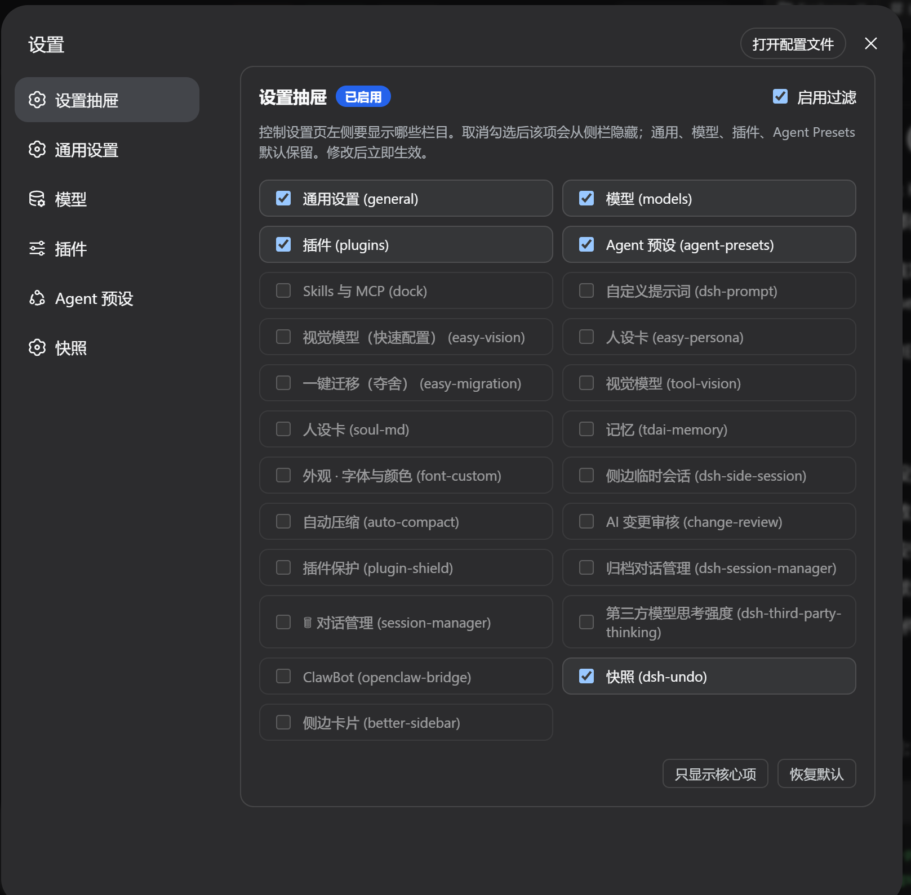

# Settings Drawer (`dsh-settings-drawer`)

A DeepSeek Harness web UI plugin that lets you choose which settings sections, plugin tabs, and plugin configuration entries appear.

Unchecking an item hides its entry immediately. Core pages (General, Models, Plugins, Agent Presets, Account) stay visible by default. Hiding an entry does not disable its plugin.

[中文说明](README.zh.md)

## Preview



The screenshot shows 1.2.0; 1.3.0 groups the live entries by surface.

## Features

- Hide or show any settings section from the left navigation.
- Changes apply immediately and persist in your browser.
- Discovers live `settings.section`, `settings.plugins.tab`, and `plugins.item` contributions, including new DSH 0.2 plugin configuration entries.
- Removed plugins no longer linger: the list only shows currently registered sections.
- Manual refresh (`⟳`) re-syncs the list without deleting preferences for temporarily unloaded plugins.
- Core settings pages, including Account, stay visible by default; new plugin tabs and configuration entries also start visible.
- Disabling or unloading the drawer restores the original registry and releases subscriptions.
- No dependency on generated CSS class names or DOM mutation observers.
- Pure client-side UI plugin — no extra services, no network calls.

## Install

From GitHub:

```sh
dsh plugin --profile web add github:zizhongfeiyang/dsh-settings-drawer
```

Official DSH 0.2 Desktop uses the `desktop` profile. Install the bundled `dsh` command through the app's **Manage dsh command** menu, initialize Desktop by opening it once, then fully quit the app before running:

```sh
dsh plugin --profile desktop add github:zizhongfeiyang/dsh-settings-drawer
```

Use Desktop's bundled command for that profile; an npm-installed `dsh` cannot manage it. Older EAC distributions may still use `web-desktop`; select the profile your distribution actually runs. See the [official Desktop command instructions](https://github.com/deepseek-ai/deepseek-harness/blob/dsh-v0.2.0-rc.2/apps/desktop/README.md#bundled-command-runtime).

From a locally packed or [release](https://github.com/zizhongfeiyang/dsh-settings-drawer/releases) tarball:

```sh
dsh plugin --profile web add ./dsh-settings-drawer-1.3.0.tgz
```

For Desktop tarballs, use `--profile desktop` with the bundled command. After installing, restart Desktop or the Web service and reload the page. When upgrading from 1.2.0, a full page reload or app restart is required to remove that version's unmanaged observer and registry wrapper.

## Usage

1. Open **Settings**.
2. Open **设置抽屉** (Settings Drawer) at the top of the left nav.
3. Uncheck items in **设置栏目**, **插件标签**, or **插件配置项**. The corresponding entry disappears immediately. Groups with no registered entries are omitted.
4. **只显示核心项** retains the core sections, the `all` plugin tab, and the built-in Shell, Agent Loop, Subagent, and Web Search configuration entries. **恢复默认** clears saved overrides.

## Configuration

| Item | Value |
| --- | --- |
| npm package name | `dsh-settings-drawer` |
| UI display name | 设置抽屉 / Settings Drawer |
| localStorage key | `dsh_settings_drawer_config_v2` |
| Default visible sections | General, Models, Plugins, Agent Presets, Account, and the legacy `dock` / `dsh-prompt` entries |
| New plugin surfaces | Visible by default; independent `visiblePluginTabs` and `visiblePluginItems` maps |

1.2.0's `enableDrawer` and `visibleCards` values are retained under the same storage key. Explicit choices, including hiding a core page, are preserved. Unregistered entries disappear from the list without losing saved preferences.

## Tested with

- 1.3.0: automated integration checks using the published DSH 0.2.0-rc.2 SlotRegistry/Cordis and React components, plus the published 0.1.0-rc.7 SlotCore contract.
- Historical 1.2.0 manual checks: DSH 0.1.0-rc.6 / rc.7, EAC 3.0.1 / 4.1.0, and Chrome-based Windows Web UI.

The 1.3.0 tests exercise registration, filtering, configuration migration, live updates, storage events, and unload/re-enable behavior. They do not boot a complete Desktop app or run a browser end-to-end test.

## Development

```sh
npm ci --legacy-peer-deps --ignore-scripts
npm run check
npm test
npm pack
```

The legacy peer option is needed only for the two pinned test fixtures' different DSH peer contracts. Test dependencies are development-only and are not bundled into the installed plugin.

The package contains:

- `lib/index.js` — host entry
- `lib/client.js` — browser client
- `cordis.patch.yml` — bundle patch
- `README.md`, `README.zh.md`

## Feedback

Found a bug or have a feature request? Open an [issue](https://github.com/zizhongfeiyang/dsh-settings-drawer/issues) and use the provided templates.

## License

MIT
